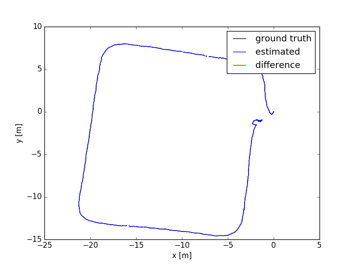
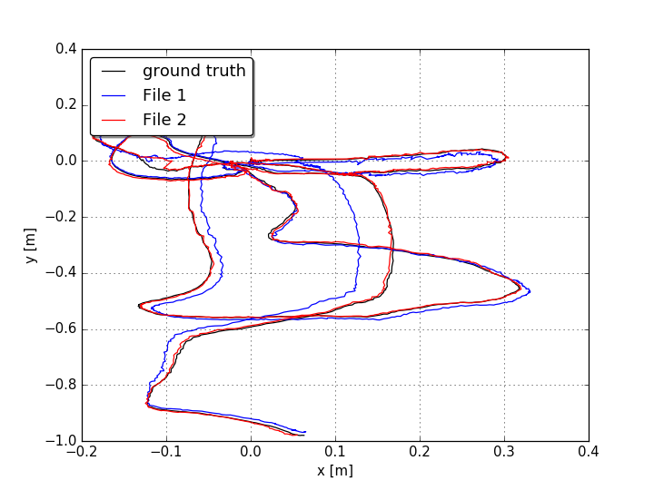

## Tools for Evaluating SLAM Systems

### distance.py

This file is used to calculate the movement distance of the sensor.

```
python2 distance.py file_name
```

*The format of your text file should be " time_stamp tx ty tz ....."*



### ate_trajectory.py

this file is used to calculate the ATE and trajectory for two input files, which is based on associate.py. 



```
python2 ate_trajectory.py gt.txt file1.txt file2.txt --verbose --plot trajectory.png
```


 


