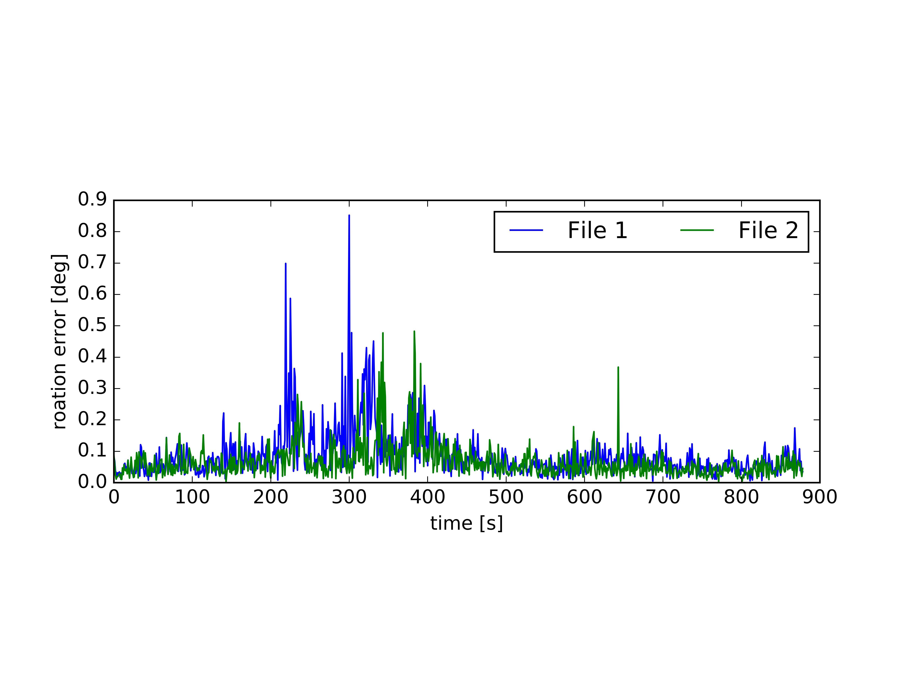

## Tools for Evaluating SLAM Systems

### distance.py

This file is used to calculate the movement distance of the sensor.

```
python2 distance.py file_name
```

*The format of your text file should be " time_stamp tx ty tz ....."*


## RGB-D Files: 

### ate_trajectory.py

This file is used to calculate the absolute trajectory error (ATE) and trajectory for two input files, which is based on associate.py. 


```
python2 ate_trajectory.py gt.txt file1.txt file2.txt --verbose --plot trajectory.png
```


 ### rpe_chart.py 

This file is used to compute the relative pose error (RPE) in translation and rotation, which is based on associate.py.




```
python2 rpe_chart.py gt.txt file1.txt file2.txt --fixed_delta --plot rpe
```


## Acknowledgement

[Useful tools for the RGB-D benchmark](https://vision.in.tum.de/data/datasets/rgbd-dataset/tools)